# Database ERD Diagram

## Mermaid ERD Diagram

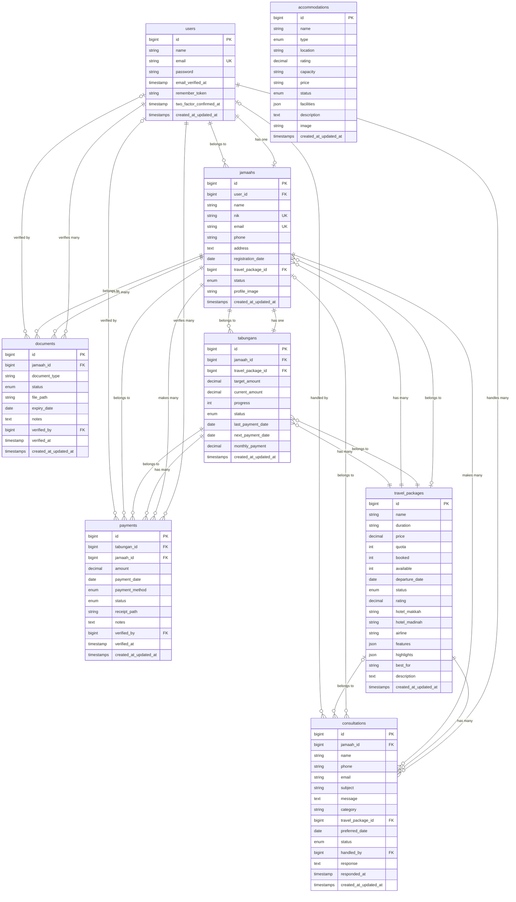

## Database Flow Diagram

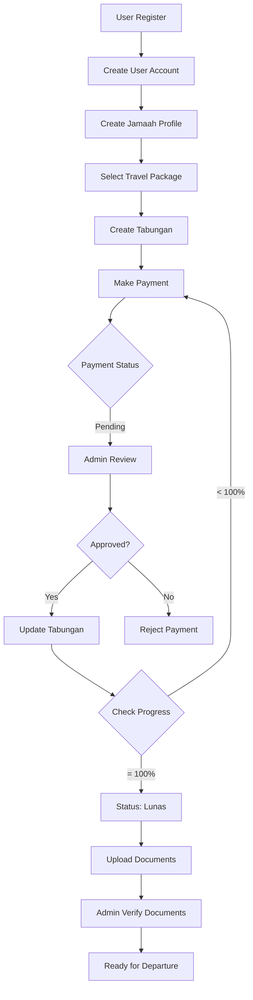

## Payment Verification Flow

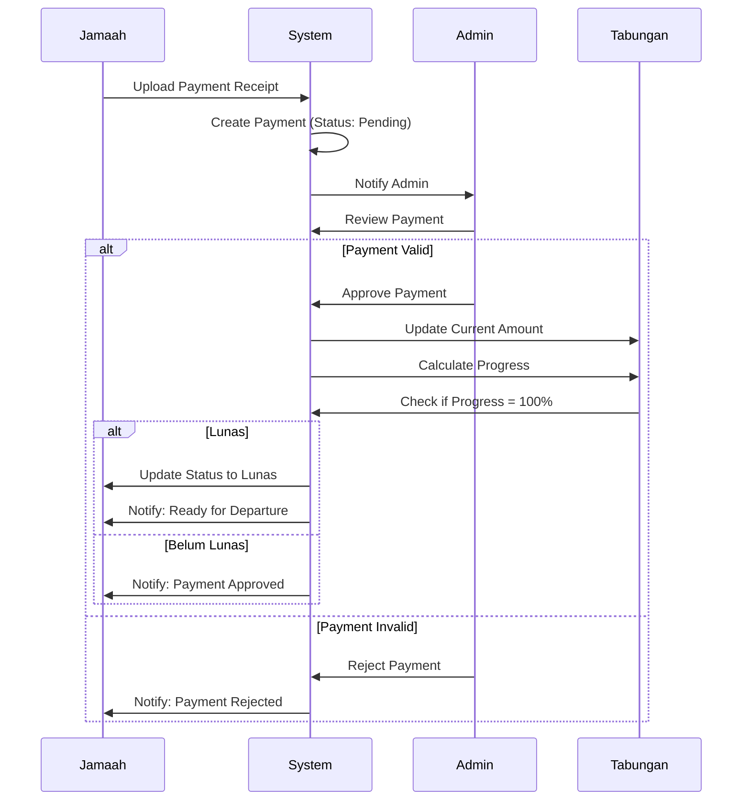

## Document Upload Flow

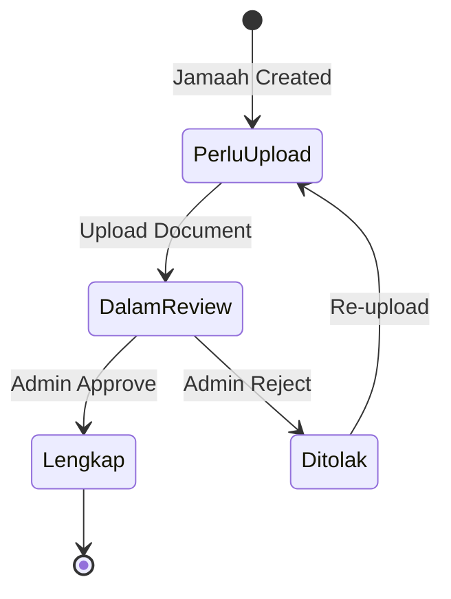

## Consultation Flow

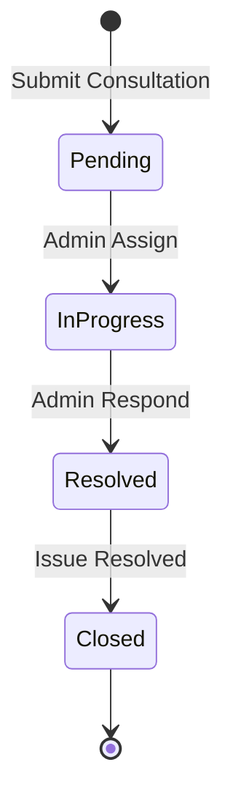

## Tabungan Progress Flow

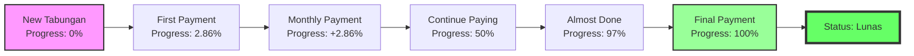

## System Architecture

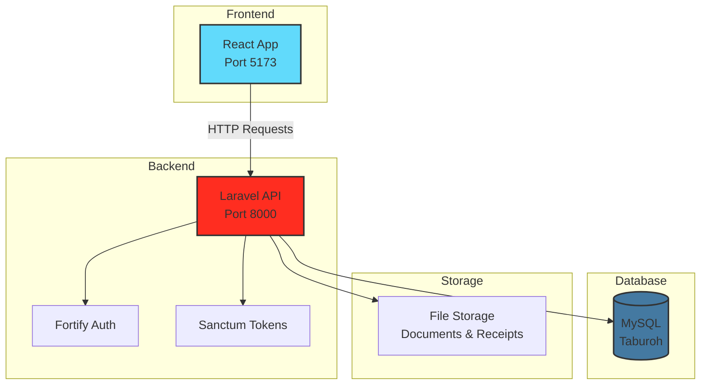

## Data Flow: Complete Journey

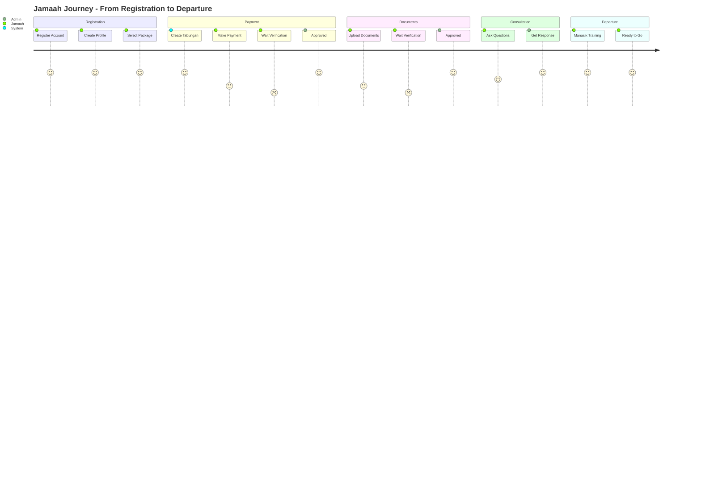

## Package Booking Timeline

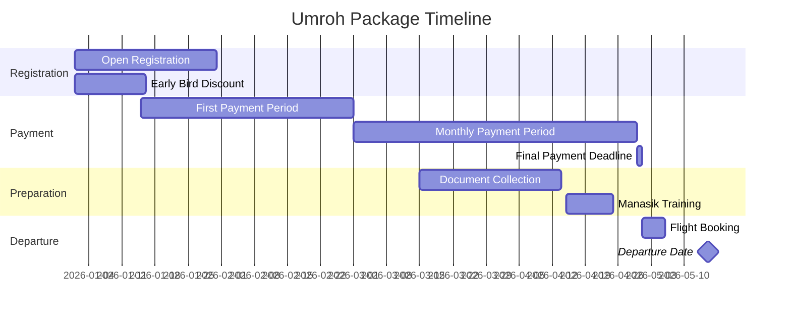

## Entity Counts (Visual)

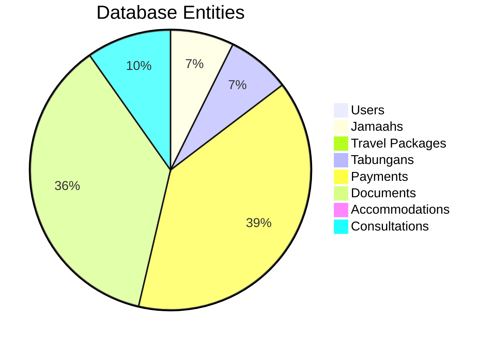

## Status Distribution

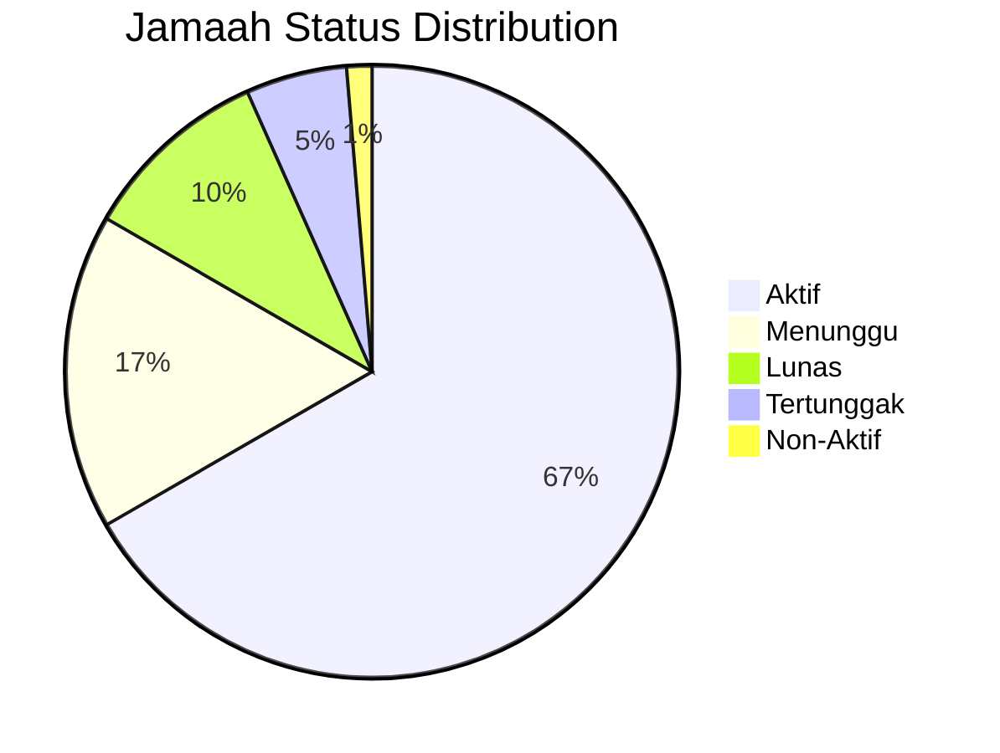

## Payment Methods Distribution

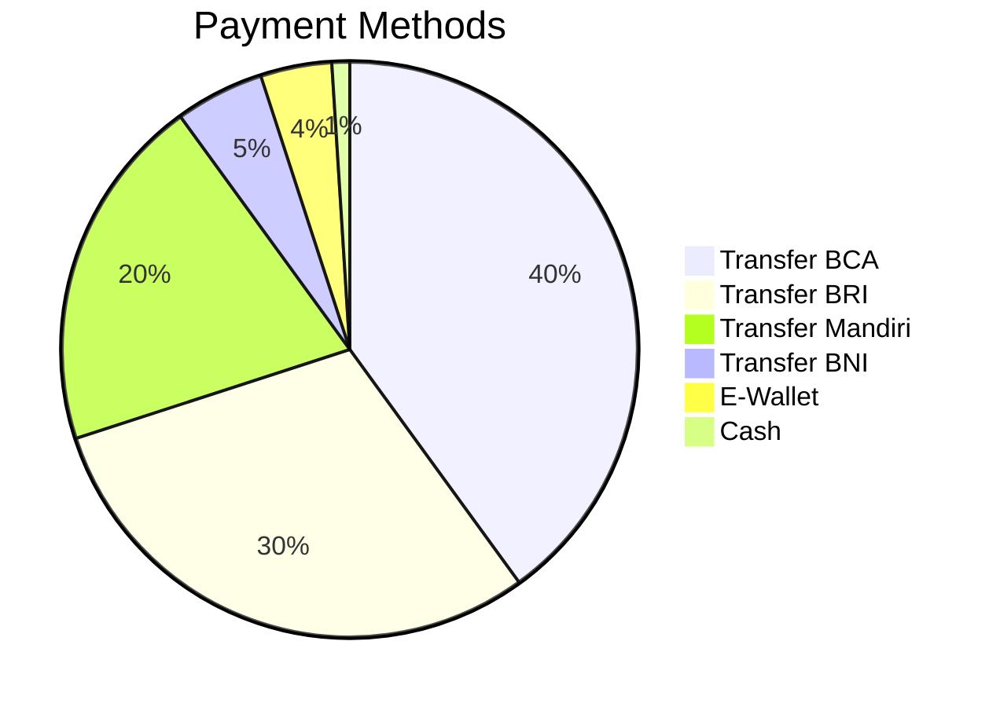
